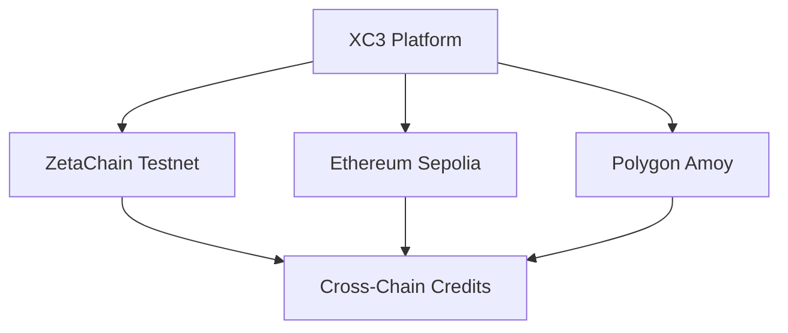
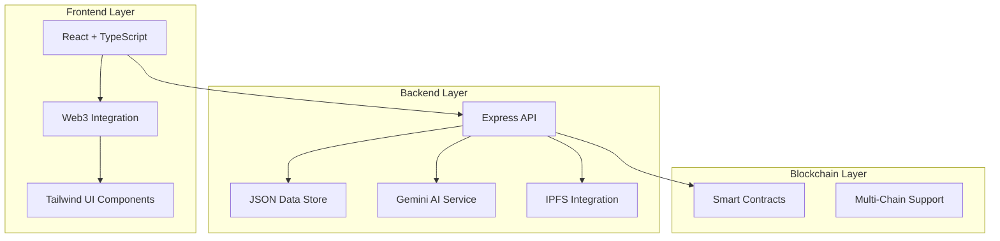

# 🌱 XC3 - Universal Carbon Credit Platform

<div align="center">


[](LICENSE)
[](https://www.typescriptlang.org/)
[](https://reactjs.org/)
[](https://ethereum.org/)

**A modern carbon credits platform: AI-verified, blockchain-powered, DeFi-enabled**

[🚀 Live Demo](https://a6e65c76b17a4526b10a50d4149de5f4-42956381-2536-49cb-8e92-438072.fly.dev/) • [🤝 Contributing](#-contributing)

</div>

---

## 📋 Table of Contents

- [🌟 What is XC3?](#-what-is-xc3)
- [🔥 The Problem](#-the-problem)
- [⚡ My Solution](#-our-solution)
- [🏗️ Architecture](#️-architecture)
- [🚀 Getting Started](#-getting-started)
- [💻 Tech Stack](#-tech-stack)
- [📱 Features](#-features)
- [🔧 Development](#-development)
- [🚀 Deployment](#-deployment)
- [🤝 Contributing](#-contributing)
- [📄 License](#-license)

## 🌟 What is XC3?

**XC3 (Cross-Chain Carbon Credits)** is an MVP platform demonstrating how carbon credits can be verified, traded, and monetized using modern Web3 technologies. This project showcases the potential for transforming the carbon credit industry with AI verification and blockchain infrastructure.

> **Vision**: Make carbon credits simple, trustworthy, and accessible through innovative technology

### 🎯 Key Innovations (MVP Implementation)

| Feature                 | Traditional Market | XC3 Platform (Demo)    |
| ----------------------- | ------------------ | ---------------------- |
| **Verification Time**   | 3-6 months         | Minutes (AI-powered)   |
| **Cross-Chain Support** | None               | Multi-chain ready      |
| **User Interface**      | Complex forms      | Modern Web3 UX        |
| **Transparency**        | Opaque processes   | AI scoring system      |
| **Accessibility**       | Institutions only  | Web3 wallet integration|

## 🔥 The Problem

The global carbon credit market faces significant challenges:

### 🚨 **Major Issues**

1. **🔍 Trust and Verification**
   - Inconsistent verification standards
   - Lengthy approval processes (months)
   - High verification costs ($10,000+)

2. **⏰ Market Inefficiencies**
   - Fragmented marketplaces
   - Limited price discovery
   - Poor liquidity

3. **🏛️ Accessibility Barriers**
   - High minimum investments
   - Complex regulatory requirements
   - Limited retail participation

4. **💸 Technology Gaps**
   - Outdated infrastructure
   - No DeFi integration
   - Limited cross-chain functionality

## ⚡ My Solution

**XC3 demonstrates solutions to carbon credit industry challenges:**

### 🤖 **AI-Powered Verification (Demo)**


- **Gemini AI Integration**: Google's AI analyzes project documents
- **Instant Analysis**: Get verification scores in minutes
- **Transparent Scoring**: Clear explanations for verification decisions
- **Document Processing**: Supports multiple file formats

### ⛓️ **Multi-Chain Architecture**



- **Smart Contract Deployment**: Ready for Ethereum, Polygon, ZetaChain
- **Cross-Chain Ready**: Architecture supports multi-chain expansion
- **ERC-1155 Standard**: Efficient multi-token implementation

### 🏦 **DeFi Integration (Prototype)**

| Product             | Description                      | Status        |
| ------------------- | -------------------------------- | ------------- |
| **Credit Vault**    | Use carbon credits as collateral | Prototype     |
| **Marketplace**     | Buy/sell carbon credits          | Demo Ready    |
| **Portfolio**       | Track credit holdings            | Implemented   |
| **Lending**         | Borrow against credits           | Prototype     |

## 🏗️ Architecture

### 🎨 **System Overview**



### 📊 **Current Data Storage**

Currently using JSON-based storage for rapid prototyping:

```json
{
  "projects": [],
  "verifications": [],
  "carbonCredits": [],
  "marketplace": []
}
```

*Production-ready PostgreSQL schemas are included for future scaling*

## 🚀 Getting Started

### ⚡ **Quick Start**

```bash
# Clone the repository
git clone https://github.com/VaibhavBhagat665/XC-3.git
cd XC-3

# Install dependencies
pnpm install

# Set up environment variables
cp .env.example .env
# Edit .env with your configuration

# Start development server
pnpm dev

# Open http://localhost:8080
```

### 📱 **Demo Walkthrough**

1. **Explore Interface**: Modern dark theme with animated elements
2. **Connect Wallet**: Web3 wallet integration (demo mode available)
3. **Browse Projects**: View carbon credit projects
4. **AI Verification**: Experience AI-powered document analysis
5. **Marketplace**: Explore trading interface
6. **DeFi Features**: Test lending and portfolio features

## 💻 Tech Stack

### 🎨 **Frontend**
- **React 18** + **TypeScript** - Modern component architecture
- **Vite** - Fast development and builds
- **Tailwind CSS** - Custom design system with neon aesthetics
- **Framer Motion** - Smooth animations
- **Wagmi v2** - Web3 integration
- **Radix UI** - Accessible component primitives

### ⚙️ **Backend**
- **Express.js** + **TypeScript** - API server
- **JSON Storage** - File-based data (PostgreSQL schemas ready)
- **Multer** - File upload handling
- **CORS** - Cross-origin resource sharing

### 🤖 **AI & Services**
- **Gemini AI** - Document verification
- **IPFS** (Web3.Storage) - Decentralized file storage
- **Custom Algorithms** - Risk assessment and scoring

### ⛓️ **Blockchain**
- **Solidity 0.8.20** - Smart contract development
- **Foundry** - Development toolkit
- **ERC-1155** - Multi-token standard
- **Multi-Chain Support** - Ethereum, Polygon, ZetaChain

## 📱 Features

### 🔍 **Current Implementation**

- ✅ **Modern UI/UX**: Dark theme with neon accents and animations
- ✅ **Project Management**: Create and manage carbon projects
- ✅ **AI Verification**: Gemini AI-powered document analysis
- ✅ **Marketplace Interface**: Browse and explore carbon credits
- ✅ **Web3 Integration**: Wallet connection and blockchain interaction
- ✅ **Portfolio Dashboard**: Track investments and activity
- ✅ **DeFi Prototypes**: Lending and collateral features

### 🚧 **In Development**

- 🔄 **Enhanced AI Models**: More sophisticated verification
- 🔄 **Full Marketplace**: Complete trading functionality
- 🔄 **Cross-Chain Deployment**: Multi-network support
- 🔄 **Advanced DeFi**: Yield farming and liquidity pools

## 🔧 Development

### 📁 **Project Structure**

```
xc3-platform/
├── client/                 # React frontend
│   ├── components/         # UI components
│   ├── pages/             # Route components
│   ├── hooks/             # Custom React hooks
│   └── lib/               # Utilities
├── server/                # Express backend
│   ├── routes/            # API endpoints
│   ├── lib/               # Services
│   └── scripts/           # Database scripts
├── contracts/             # Solidity contracts
│   ├── src/               # Contract source
│   └── script/            # Deployment scripts
├── shared/                # Shared code
└── public/                # Static assets
```

### 🔧 **Environment Setup**

```bash
# Required environment variables
GEMINI_API_KEY="your_gemini_api_key"
WEB3_STORAGE_TOKEN="your_web3_storage_token"

# Blockchain deployment (optional)
PRIVATE_KEY="your_deployment_key"
SEPOLIA_RPC_URL="your_sepolia_rpc"
POLYGON_AMOY_RPC_URL="your_polygon_rpc"
ZETA_TESTNET_RPC_URL="your_zeta_rpc"
```

## 🤝 Contributing

Contributions are welcome! Here's how to get started:

### 🐛 **Bug Reports**
- Use GitHub Issues for bug reports
- Include reproduction steps
- Provide environment details

### 💡 **Feature Requests**
- Discuss ideas in GitHub Discussions
- Provide detailed use cases
- Consider implementation feasibility

### 🔧 **Code Contributions**

```bash
# Development workflow
git checkout -b feature/new-feature
pnpm install
pnpm dev
# Make changes and test
pnpm typecheck
git commit -m "feat: add new feature"
git push origin feature/new-feature
```

### 🎯 **Areas for Contribution**
- [ ] Enhanced AI verification models
- [ ] Additional blockchain integrations
- [ ] Mobile-responsive improvements
- [ ] Documentation and tutorials
- [ ] Testing and quality assurance

## 📞 Support & Community

### 🆘 **Get Help**
- **GitHub Issues**: Bug reports and questions
- **GitHub Discussions**: Community chat
- **Email**: [vaibhavbhagat7461@gmail.com](mailto:vaibhavbhagat7461@gmail.com)

### 🤝 **Connect**
- **Live Demo**: [XC3 Platform](https://xc-3-web.vercel.app)
- **LinkedIn**: [Vaibhav Bhagat](https://www.linkedin.com/in/vaibhavbhagat5)
- **GitHub**: [VaibhavBhagat665](https://github.com/VaibhavBhagat665)

## 📄 License

This project is licensed under the **MIT License** - see the [LICENSE](LICENSE) file for details.

### 🔒 **Security**

For security vulnerabilities, please email vaibhavbhagat7461@gmail.com instead of using public issues.

---

<div align="center">

**Built with 💚 for a sustainable future**

[Website](https://xc-3-web.vercel.app) • [LinkedIn](https://www.linkedin.com/in/vaibhavbhagat5) • [GitHub](https://github.com/VaibhavBhagat665)

**Making carbon credits accessible through innovative technology** 🌱

</div>

